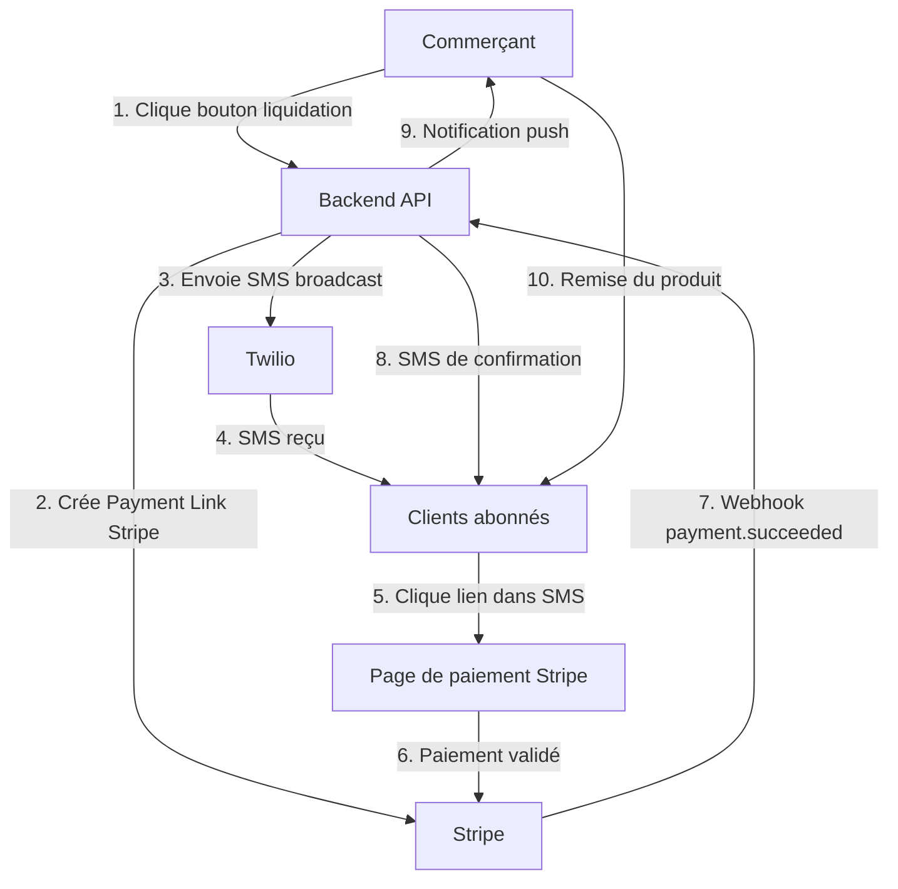
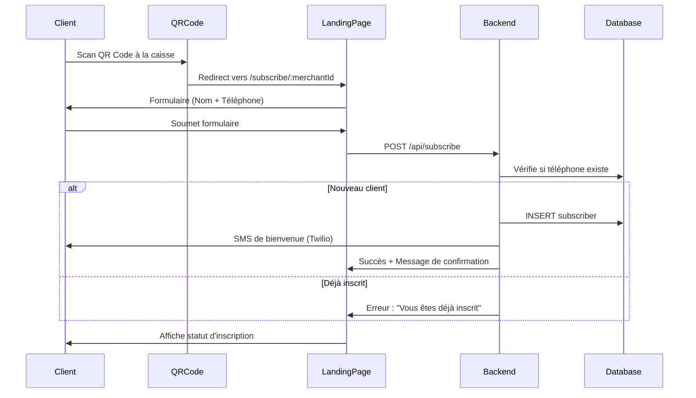
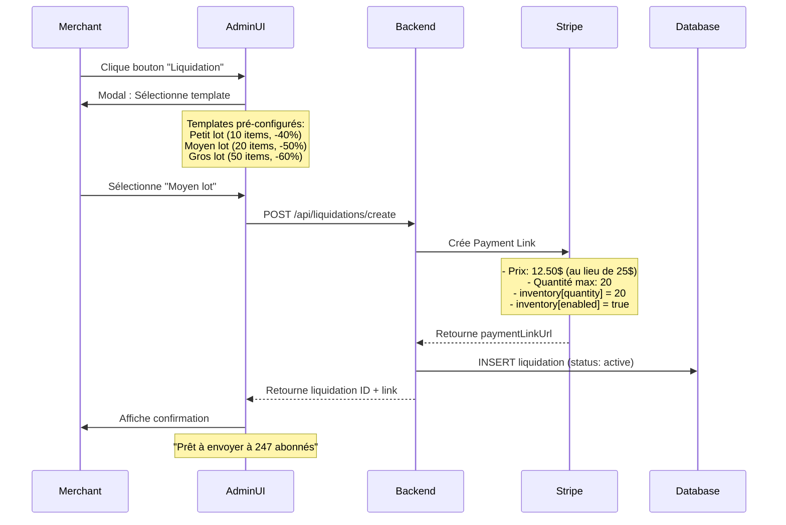
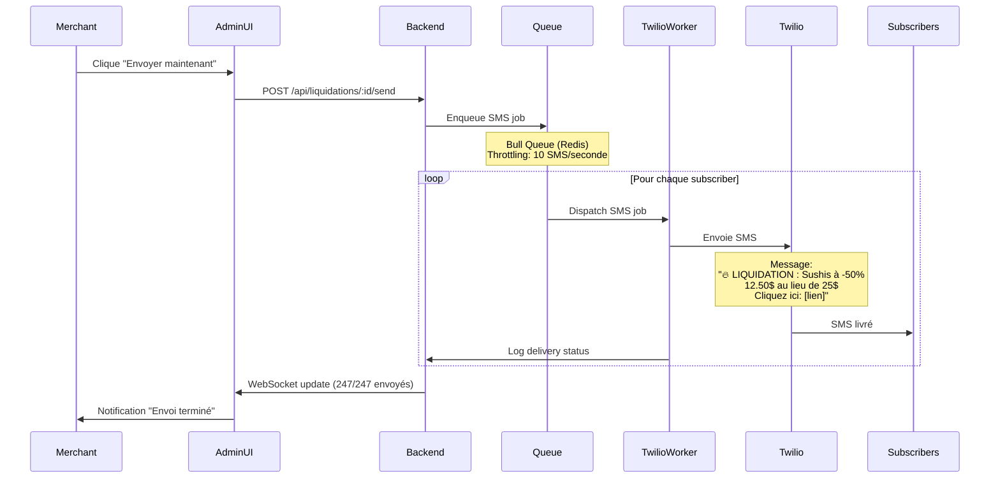
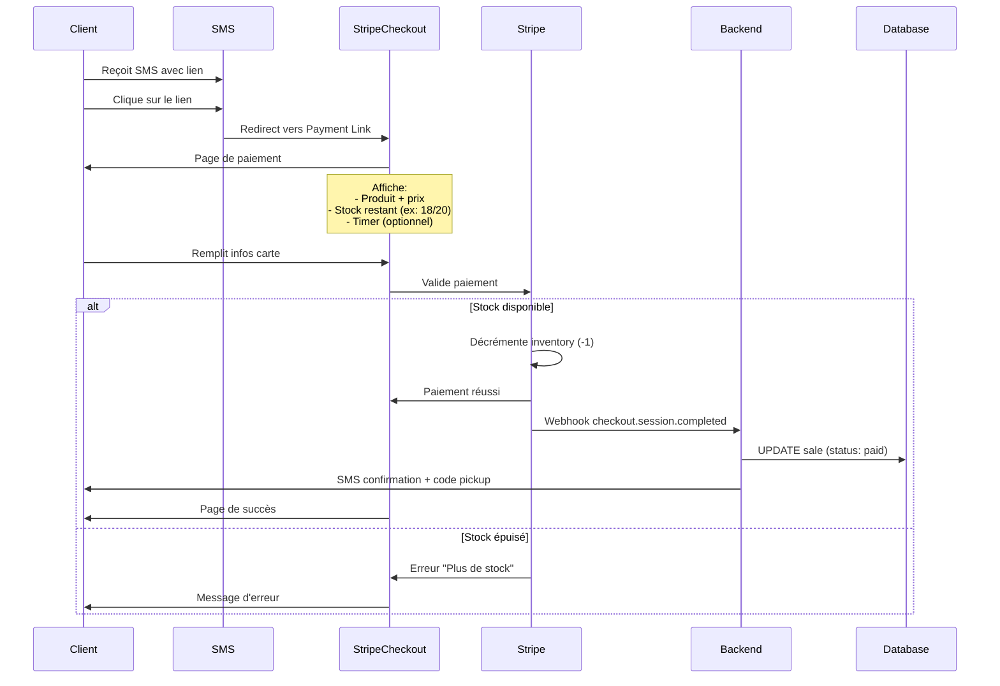
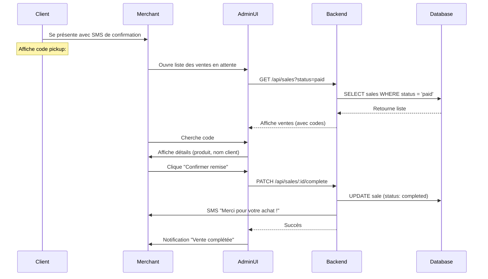
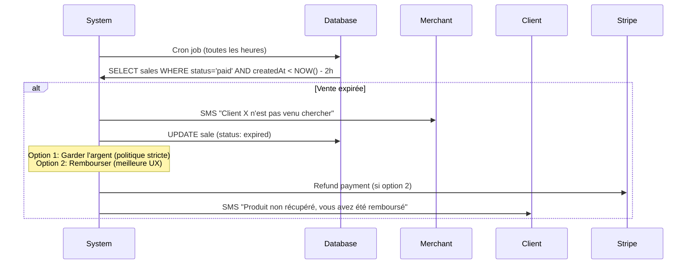
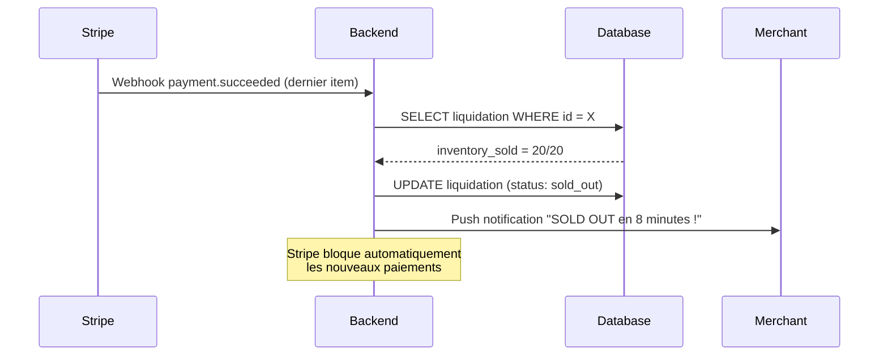
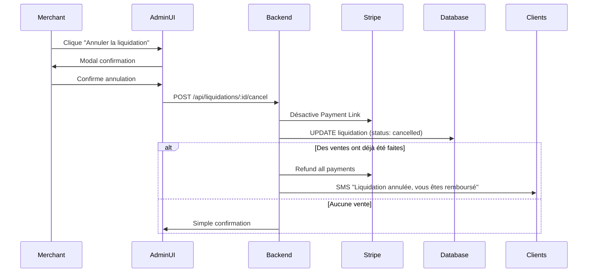
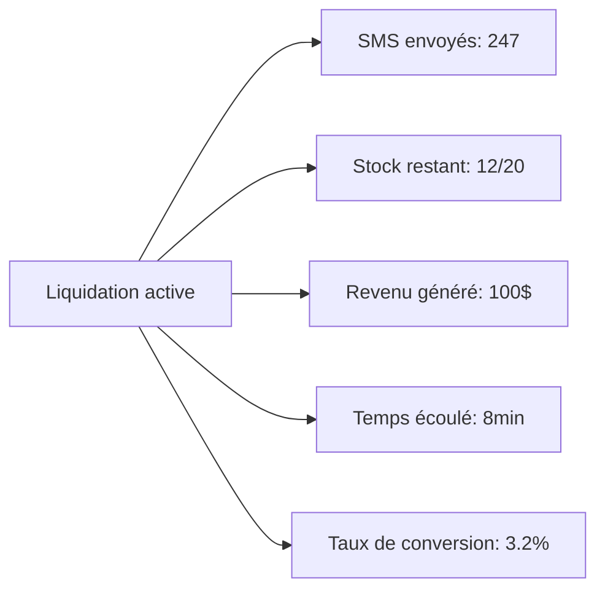

# Flow - Liquida-Choc | Diagrammes de flux complets

## Vue d'ensemble du système



---

## Flux détaillé par étape

### 📱 **FLUX 1 : Inscription du client (Opt-in SMS)**

**Objectif** : Recruter des abonnés SMS pour le commerçant.



**Points clés :**
- **Double opt-in** : Pas nécessaire (complique le flow), mais envoyer un SMS de bienvenue pour confirmer
- **Validation téléphone** : Format international (+1XXXXXXXXXX)
- **Anti-spam** : Rate limit sur l'endpoint (max 5 inscriptions/IP/heure)
- **RGPD-friendly** : Lien de désinscription dans chaque SMS

---

### 🔴 **FLUX 2 : Création de la liquidation (Action du commerçant)**

**Objectif** : Le commerçant déclenche une vente flash en 1 clic.



**Points clés :**
- **Templates pré-configurés** : Évite la saisie manuelle (gain de temps)
- **Inventory management** : Géré côté Stripe (pas de double vente)
- **Validation** : Le commerçant peut prévisualiser avant d'envoyer
- **Rollback** : Possibilité d'annuler avant l'envoi SMS

---

### 📨 **FLUX 3 : Envoi SMS broadcast (via Twilio)**

**Objectif** : Notifier tous les abonnés sans surcharger l'API Twilio.



**Points clés :**
- **Rate limiting Twilio** : 10 SMS/sec (limite par défaut, ajustable)
- **Gestion d'erreurs** : Retry 3x si échec, puis skip
- **Tracking** : Delivery status loggé en DB (delivered, failed, pending)
- **Coût** : ~0.0079$ CAD/SMS × 247 = ~1.95$ par campagne
- **Unsubscribe** : Lien "STOP" dans chaque SMS (exigence légale)

---

### 💳 **FLUX 4 : Achat client (via Stripe Payment Link)**

**Objectif** : Le client paie en ligne, Stripe gère le stock automatiquement.



**Points clés :**
- **Gestion du stock** : 100% côté Stripe (atomic, pas de race condition)
- **UX** : Stock en temps réel visible sur la page de paiement
- **Sécurité** : Stripe gère 3D Secure si nécessaire
- **Frais** : 2.9% + 0.30$ par transaction (standard Stripe)
- **Code pickup** : Généré automatiquement (ex: #LQ-A4B2) pour validation commerçant

---

### ✅ **FLUX 5 : Confirmation et pickup**

**Objectif** : Le commerçant valide la remise du produit.



**Points clés :**
- **Validation simple** : Scan code ou recherche manuelle
- **Historique** : Toutes les ventes loggées pour comptabilité
- **Feedback client** : SMS de remerciement automatique (optionnel)
- **Analytics** : Temps moyen entre achat et pickup tracké

---

### 🔄 **FLUX 6 : Gestion des cas limites**

#### **Cas 1 : Client ne vient pas chercher le produit**



**Recommandation** :
- **Phase 1** : Garder l'argent (politique affichée clairement : "À récupérer sous 2h")
- **Phase 2** : Remboursement automatique (meilleure réputation, moins de friction)

---

#### **Cas 2 : Stock épuisé avant la fin de la liquidation**



**Points clés :**
- **Aucune action requise** : Stripe gère le blocage automatiquement
- **Feedback commerçant** : Notification de succès (boost moral)

---

#### **Cas 3 : Annulation de liquidation par le commerçant**



**Points clés :**
- **Utilisé rarement** : Cas d'urgence (erreur de prix, problème produit)
- **Coût** : Frais Stripe non remboursables (à assumer)

---

## 🎯 Métriques à tracker en temps réel

### **Pour le commerçant (Dashboard)**



### **KPIs système (Admin backend)**

- **Delivery rate SMS** : % de SMS livrés avec succès
- **Click-through rate** : % de clics sur le lien
- **Conversion rate** : % d'achats après clic
- **Temps moyen de vente** : Durée entre envoi SMS et sold out
- **Revenu par campagne** : Moyenne par type de commerce
- **Taux de pickup** : % de produits effectivement récupérés

---

## 🚀 Optimisations futures (v2)

### **1. Smart scheduling**
- Détection automatique des patterns de liquidation
- Suggestion : "Vos sushis se vendent mieux le mardi à 19h"

### **2. Segmentation des abonnés**
- Tags : "Aime les sushis", "Budget serré", "Achète souvent"
- Envoi ciblé : +30% de conversion

### **3. Gamification**
- "Vous êtes le 3e acheteur aujourd'hui ! Encore 2 achats = badge fidélité"
- Boost engagement

### **4. Multi-commerce**
- Un client inscrit à 5 commerces
- Gestion centralisée des préférences

---

## ✅ Checklist de validation du flow

Avant de passer au code, vérifier :

- [ ] **Stripe Payment Links supporte inventory management** : OUI (confirmé)
- [ ] **Twilio rate limit acceptable** : 10 SMS/sec = 600/min (OK pour 10 clients × 200 abonnés)
- [ ] **Webhook Stripe → Backend sécurisé** : Signature validation obligatoire
- [ ] **Gestion des fuseaux horaires** : UTC en DB, conversion locale en UI
- [ ] **RGPD/CASL compliance** : Opt-in explicite + lien de désabonnement
- [ ] **Coûts SMS prévisibles** : Budget max/campagne défini (ex: 2$)
- [ ] **Rollback strategy** : Annulation possible jusqu'à l'envoi SMS

---

## 📱 Wireframe du SMS (exemple réel)

```
🔥 LIQUIDATION | Sushi Express

Plateaux sushis mixtes
🏷️ 12.50$ au lieu de 25$ (-50%)
📦 Stock: 20 disponibles

👉 Achetez maintenant:
https://buy.stripe.com/abc123

⏱️ Valide jusqu'à 22h ce soir
📍 Pickup: 123 rue Racine E

STOP pour ne plus recevoir ces alertes
```

**Longueur** : ~160 caractères (1 SMS = coût minimal)

---

## 🎨 Wireframe de la page Stripe (personnalisée)

### **Header**
```
🔥 Liquidation Flash - Sushi Express
⏱️ Se termine dans 2h15
```

### **Produit**
```
Plateaux de sushis mixtes (12 pièces)
Prix normal: 25.00$
Prix flash: 12.50$ (-50%)

Stock restant: 12/20
⚡ Dépêchez-vous !
```

### **Call-to-action**
```
[Acheter maintenant - 12.50$]

✅ Paiement sécurisé par Stripe
📍 À récupérer sous 2h au 123 rue Racine E
```

---

## 🔐 Sécurité du flow

### **Protections implémentées**

1. **Webhook signature verification** (Stripe)
   - Empêche les faux paiements

2. **Rate limiting** (Express + Redis)
   - 100 req/min/IP sur endpoints publics
   - 10 req/min sur /api/subscribe (anti-spam)

3. **Code pickup unique** (UUID court)
   - Empêche les fraudes de pickup

4. **HTTPS obligatoire** (Let's Encrypt)
   - Toutes les communications chiffrées

5. **Validation téléphone** (libphonenumber)
   - Format international uniquement

6. **SQL injection** (ORM Mongoose)
   - Requêtes paramétrées par défaut

7. **XSS protection** (React + helmet.js)
   - Sanitization automatique

---

## 🎯 Temps de réponse cibles

| Étape | Temps max | Statut |
|-------|-----------|--------|
| Création Payment Link (Stripe) | < 2s | ⚡ Critique |
| Envoi SMS broadcast (247 SMS) | < 30s | ⚠️ Important |
| Webhook processing | < 500ms | ⚡ Critique |
| Dashboard load time | < 1s | ✅ Nice to have |

---

**Next steps** : Voir `architecture.md` pour l'implémentation technique de ces flows.
