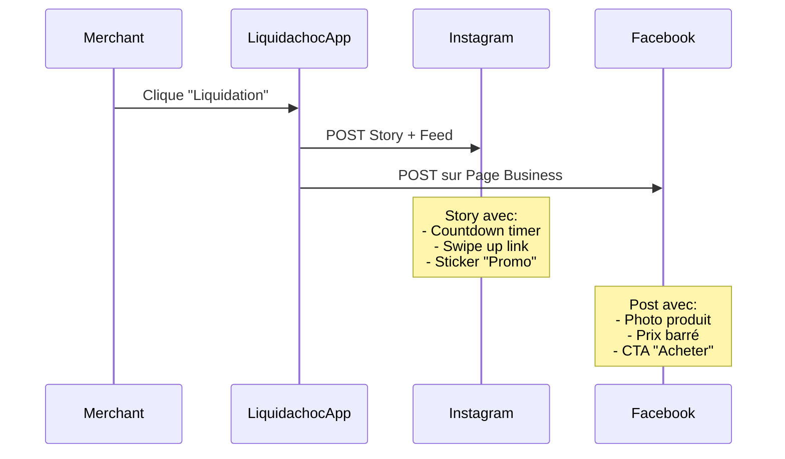

# Improvements - Liquida-Choc | Axes d'upsell & Évolutions

## 🎯 Objectif général

Passer de **"Bouton one-shot gratuit"** à **"Plateforme SaaS premium"** en monétisant des fonctionnalités avancées.

**Stratégie de pricing** :
- **Phase 1 (MVP)** : Gratuit (ou 10% de commission sur ventes)
- **Phase 2 (3-6 mois)** : Freemium (49$/mois pour features avancées)
- **Phase 3 (12+ mois)** : Tiers multiples (Basic, Pro, Enterprise)

---

## 💰 Upsells prioritaires (ROI élevé)

### **1. Système de fidélité automatique**

**Problème client** :
> "Mes clients achètent une fois puis disparaissent. J'aimerais les faire revenir sans gérer un programme de points manuellement."

**Solution** :
Programme de fidélité intégré avec gamification.

#### **Features**
```yaml
Bronze (0-3 achats):
  - Badge "Sauveur du gaspillage"
  - 5% de réduction sur le 4e achat

Silver (4-9 achats):
  - Badge "Chasseur de deals"
  - 10% de réduction permanente
  - Accès anticipé aux liquidations (15 min avant les autres)

Gold (10+ achats):
  - Badge "VIP Anti-gaspi"
  - 15% de réduction permanente
  - 1 produit gratuit par mois
  - Invitation à des événements exclusifs
```

#### **Implémentation technique**
- Tracking automatique dans `subscribers.stats.totalPurchases`
- SMS personnalisés : "Plus que 2 achats pour devenir Silver !"
- Dashboard commerçant : Liste des VIPs à chouchouter

#### **Pricing**
- **Basic (gratuit)** : Pas de fidélité
- **Pro (49$/mois)** : Fidélité Bronze/Silver
- **Enterprise (99$/mois)** : Fidélité complète + customisation

#### **Pitch de vente**
> "Vos clients fidèles valent 3x plus qu'un client ponctuel. Avec le système de fidélité automatique, vous transformez vos acheteurs one-shot en communauté engagée. Le Sushi Express a augmenté ses ventes récurrentes de 40% en 2 mois."

---

### **2. Statistiques mensuelles & Rapport de pertes évitées**

**Problème client** :
> "Je ne sais pas combien je récupère vraiment avec Liquida-Choc. J'aimerais voir l'impact chiffré pour justifier l'investissement."

**Solution** :
Dashboard d'analytics avec PDF exportable (pour compta).

#### **Features**

##### **KPIs clés affichés**
```typescript
interface MonthlyReport {
  month: string;                    // "Janvier 2025"

  // Pertes évitées
  totalProductsSaved: number;       // 127 produits
  totalValueSaved: number;          // 2 450$ (prix original)
  totalRevenueRecovered: number;    // 1 225$ (prix liquidation)

  // Performance
  liquidationsCount: number;        // 18 campagnes
  avgTimeToSoldOut: number;         // 12 minutes
  conversionRate: number;           // 8.5% (SMS → Achat)

  // Clients
  newSubscribers: number;           // +34 ce mois
  totalSubscribers: number;         // 247 total
  repeatPurchaseRate: number;       // 22% (achats multiples)

  // Comparaison
  vsLastMonth: {
    revenueDelta: number;           // +15%
    subscribersDelta: number;       // +14%
  };

  // Projections
  projectedAnnualSavings: number;   // 14 700$ (si même rythme)
}
```

##### **Visualisations**
- Graphique : Revenu récupéré par semaine (line chart)
- Graphique : Top 5 produits liquidés (bar chart)
- Heatmap : Meilleurs jours/heures pour liquider
- Comparaison : Votre commerce vs moyenne de la plateforme

##### **Export PDF**
```
📊 Rapport Liquida-Choc - Janvier 2025
Sushi Express

Résumé exécutif:
✅ 127 produits sauvés de la poubelle
💰 1 225$ de revenu récupéré (vs 0$ jetés)
📈 +15% vs mois dernier

[Graphiques + tableaux détaillés]

🌍 Impact environnemental:
- 38 kg de nourriture non gaspillée
- 152 kg CO2 évités

Généré par Liquida-Choc | liquidachoc.com
```

#### **Implémentation technique**
- Charts : Recharts (React) ou Chart.js
- PDF : Puppeteer (headless Chrome) ou jsPDF
- Envoi auto : Cron job le 1er de chaque mois
- Emails : Resend.com (99 emails/mois gratuit)

#### **Pricing**
- **Basic** : Stats de base (7 derniers jours)
- **Pro** : Stats complètes + export PDF
- **Enterprise** : Benchmarking vs compétition + conseils IA

#### **Pitch de vente**
> "Imaginez montrer à votre comptable : '1 225$ récupérés ce mois-ci grâce à Liquida-Choc'. C'est exactement ce que notre rapport mensuel fait. En 2 clics, vous avez un PDF professionnel avec graphs et projections annuelles."

---

### **3. Intégration Instagram/Facebook**

**Problème client** :
> "J'ai 2000 followers sur Insta, mais je ne peux pas les notifier d'une liquidation en temps réel comme avec les SMS."

**Solution** :
Auto-post des liquidations sur les réseaux sociaux.

#### **Features**

##### **Flow automatique**


##### **Templates de posts (auto-générés)**
```
Instagram Story:
┌─────────────────┐
│  [Photo produit]│
│                 │
│  🔥 LIQUIDATION │
│  -50% sur sushis│
│                 │
│  12.50$ ⏱️ 2h   │
│                 │
│  [Swipe up]     │
└─────────────────┘

Facebook Post:
🚨 ALERTE LIQUIDATION 🚨

Nos plateaux de sushis mixtes sont à -50% ce soir !

❌ Prix normal : 25$
✅ Prix flash : 12.50$

📦 Stock limité : 20 disponibles
⏰ Jusqu'à 22h seulement

👉 Achetez en ligne et venez chercher :
[Lien Stripe]

#LiquidaChoc #AntiGaspi #Chicoutimi
```

#### **Implémentation technique**
- API Meta Graph API (Instagram + Facebook)
- Templates Canva (design auto via API)
- Queue d'envoi (éviter rate limits)
- Analytics : Tracking des clics IG → Stripe

#### **Pricing**
- **Basic** : Pas d'intégration sociale
- **Pro** : Auto-post Facebook
- **Enterprise** : Auto-post Facebook + Instagram + TikTok

#### **Pitch de vente**
> "Vos 2000 followers Instagram dorment. Avec l'auto-post, chaque liquidation devient un post/story automatique. Le Café Cambio a triplé ses ventes en ajoutant Instagram (12 achats au lieu de 4)."

---

### **4. Planificateur de liquidations récurrentes**

**Problème client** :
> "Chaque mardi et jeudi à 19h, j'ai du surplus. Je dois me souvenir de cliquer sur le bouton, c'est pénible."

**Solution** :
Liquidations automatiques déclenchées par calendrier.

#### **Features**
- Planification : "Tous les mardis à 19h, liquider 10 plateaux de sushis à -40%"
- Confirmation SMS au commerçant : "Liquidation prévue dans 1h, confirmer ? OUI/NON"
- Pause/reprise facile (si vacances ou rupture de stock)
- Smart scheduling : IA suggère les meilleurs créneaux basés sur l'historique

#### **UI**
```
📅 Planificateur

┌────────────────────────────────┐
│ Lundi      : Pas de liquidation│
│ Mardi      : 19h - Sushis (-40%)│
│ Mercredi   : Pas de liquidation│
│ Jeudi      : 19h - Sushis (-40%)│
│ Vendredi   : 20h - Double lot  │
│ Samedi     : Pas de liquidation│
│ Dimanche   : Fermé             │
└────────────────────────────────┘

[+ Ajouter créneau]
```

#### **Pricing**
- **Pro** : 2 créneaux récurrents/semaine
- **Enterprise** : Illimité + smart scheduling IA

---

### **5. Marketplace multi-commerces**

**Problème client (côté consommateur)** :
> "Je dois m'inscrire à 5 commerces différents pour recevoir leurs deals. C'est lourd."

**Solution** :
App mobile centralisée où le consommateur voit TOUS les deals de sa région.

#### **Features**

##### **App consommateur (React Native)**
```
🏠 Accueil

Liquidations actives près de vous:

┌────────────────────────────────┐
│ 🍣 Sushi Express               │
│ Plateaux mixtes - 12.50$ (-50%)│
│ 📍 1.2 km - Stock: 8/20        │
│ ⏰ Expire dans 1h43            │
│ [Acheter]                      │
└────────────────────────────────┘

┌────────────────────────────────┐
│ 🥖 Boulangerie Racine          │
│ Viennoiseries - 1.50$ (-60%)   │
│ 📍 2.7 km - Stock: 12/30       │
│ ⏰ Expire dans 3h12            │
│ [Acheter]                      │
└────────────────────────────────┘

[Filtres: 🍣 Sushis | 🥖 Boulangerie | ☕ Café]
```

##### **Features avancées**
- Notifications push (opt-in par catégorie)
- Historique d'achats cross-commerces
- Système de badges global
- Carte interactive avec tous les commerces partenaires

#### **Business model**
- Commerçant : 10% de commission (vs 10% sur SMS one-shot)
- Consommateur : Gratuit
- Revenue share : 70% commerçant / 30% Liquida-Choc

#### **Pricing commerçant**
- **Basic** : SMS uniquement (pas dans l'app)
- **Pro** : Inclus dans l'app marketplace
- **Enterprise** : Placement premium (en haut de liste)

#### **Pitch de vente**
> "Vos abonnés SMS, c'est bien. Mais imaginez apparaître devant 5000+ consommateurs qui cherchent des deals MAINTENANT dans Chicoutimi. La marketplace Liquida-Choc, c'est ça : votre commerce visible par toute la communauté anti-gaspi."

---

## 🌱 Features "Nice to have" (Phase 3)

### **6. Livraison via partenaires (Uber Eats, DoorDash)**
**Impact** : Élargit le rayon de clientèle (pas seulement pickup)
**Complexité** : Haute (intégration API, coûts de livraison)
**Pricing** : +20$/mois

---

### **7. Recommandations IA**
**Exemples** :
- "Vos sushis se vendent mieux le mardi à 19h qu'à 20h"
- "Réduire le prix à 11$ au lieu de 12.50$ augmenterait vos ventes de 20%"
- "Vous avez 30% de no-shows. Envoyez un rappel 1h avant expiration."

**Implémentation** : OpenAI API (analyse des données historiques)
**Pricing** : Enterprise uniquement

---

### **8. White-label pour chaînes/franchises**
**Use case** : Tim Hortons Saguenay (5 succursales) veut sa propre app branded
**Features** :
- Logo personnalisé
- Domaine custom (deals.timhortons-saguenay.com)
- Multi-locations (1 app, 5 commerces)

**Pricing** : 499$/mois (pour la chaîne) + setup de 1000$

---

### **9. Partenariats avec Too Good To Go**
**Stratégie** : Positioning "version locale" vs TGTG (international)
**Avantage** : Personnalisation poussée, relation directe avec commerçants
**Risque** : TGTG a des ressources énormes (levées de fonds)

---

### **10. Impact environnemental certifié**
**Feature** : Badge "X kg de CO2 évités" basé sur calculs scientifiques
**Partenariat** : Collaborer avec universités (UQAC ?) pour certifier les données
**Marketing** : "Commerce carboneutre grâce à Liquida-Choc"

---

## 📊 Matrice de priorisation

| Feature | Impact business | Effort dev | ROI | Priorité |
|---------|----------------|------------|-----|----------|
| **1. Fidélité** | ⭐⭐⭐⭐⭐ | ⭐⭐⭐ (moyen) | 🔥 Très élevé | **P0** |
| **2. Stats/Rapports** | ⭐⭐⭐⭐ | ⭐⭐ (faible) | 🔥 Très élevé | **P0** |
| **3. Intégration IG** | ⭐⭐⭐⭐ | ⭐⭐⭐⭐ (élevé) | 🔥 Élevé | **P1** |
| **4. Planificateur** | ⭐⭐⭐ | ⭐⭐ (faible) | 🔥 Moyen | **P1** |
| **5. Marketplace** | ⭐⭐⭐⭐⭐ | ⭐⭐⭐⭐⭐ (très élevé) | 🔥 Très élevé | **P2** |
| 6. Livraison | ⭐⭐⭐ | ⭐⭐⭐⭐ (élevé) | 🔥 Faible | **P3** |
| 7. IA Recommendations | ⭐⭐ | ⭐⭐⭐⭐ (élevé) | 🔥 Moyen | **P3** |
| 8. White-label | ⭐⭐⭐⭐ | ⭐⭐⭐⭐⭐ (très élevé) | 🔥 Élevé | **P3** |

**Roadmap suggérée** :
- **Mois 1-2** : MVP (bouton one-shot) - GRATUIT
- **Mois 3-4** : Fidélité + Stats (lancer Pro à 49$/mois)
- **Mois 5-6** : Intégration IG + Planificateur
- **Mois 7-12** : Marketplace (pivot majeur)
- **Année 2** : White-label + IA

---

## 💸 Projection de revenus (scénario optimiste)

### **Hypothèses**
- 10 clients la première année
- 50% passent au plan Pro après 2 mois
- 20% passent au plan Enterprise après 6 mois

### **Année 1**
```
Mois 1-2 (Gratuit):
- 5 clients × 0$/mois = 0$
- Commissions 10% sur ventes = ~200$/mois

Mois 3-6 (Lancement Pro):
- 5 clients Pro × 49$/mois = 245$/mois
- 5 clients gratuits × 0$ = 0$
- Commissions = ~300$/mois
- Total = 545$/mois

Mois 7-12 (Lancement Enterprise):
- 2 clients Enterprise × 99$/mois = 198$/mois
- 3 clients Pro × 49$/mois = 147$/mois
- 5 clients gratuits = 0$
- Commissions = ~400$/mois
- Total = 745$/mois

Revenue total année 1: ~4 800$
```

### **Année 2 (avec Marketplace)**
```
- 30 clients (growth 3x)
- 10 clients Enterprise × 99$ = 990$/mois
- 15 clients Pro × 49$ = 735$/mois
- 5 clients gratuits = 0$
- Commissions marketplace (5000 utilisateurs, 3 achats/mois, 10% commission, 12$ panier moyen) = 1 800$/mois
- Total = 3 525$/mois = 42 300$/an
```

**Break-even** : Mois 3-4 (quand les revenus couvrent les coûts SMS + infra)

---

## 🎁 Bonus : Features de rétention (gratuit)

### **Onboarding parfait**
- Vidéo de 2 minutes : "Comment faire votre première liquidation"
- Checklist : [✓] Compte créé → [✓] QR Code imprimé → [✓] 50+ abonnés SMS → [ ] Première vente

### **Support réactif**
- Chat en live (Crisp.chat - gratuit jusqu'à 2 agents)
- Réponse < 2h garantie
- Base de connaissances (FAQ + vidéos)

### **Communauté**
- Groupe Facebook privé : "Commerçants Liquida-Choc Saguenay"
- Partage de best practices
- Events trimestriels (meetup IRL à Chicoutimi)

### **Gamification commerçant**
- Badge "Premier 1000$ récupéré"
- Badge "100 abonnés SMS"
- Badge "Sold out en moins de 10 minutes"
- Leaderboard (opt-in) : Top 5 commerces du mois

---

## ✅ Checklist de lancement d'un upsell

Avant de développer une nouvelle feature payante :

- [ ] **Validation client** : 3+ clients pilotes ont confirmé qu'ils paieraient pour ça
- [ ] **Pricing testé** : Survey sur la fourchette de prix acceptable
- [ ] **MVP scope défini** : Version minimale fonctionnelle en < 2 semaines de dev
- [ ] **Metrics définis** : Comment mesurer le succès ? (ex: taux d'upgrade Basic → Pro)
- [ ] **Churn mitigation** : Plan B si les clients trouvent ça trop cher
- [ ] **Documentation** : Tutoriels + vidéos prêts avant le launch
- [ ] **A/B test pricing** : Tester 49$ vs 59$ sur 2 groupes

---

## 🚀 Stratégie de migration gratuit → payant

### **Timing**
- **Ne PAS demander de paiement** avant que le client ait vu de la valeur concrète
- **Attendre** : Au moins 2 liquidations réussies (preuve que ça marche)
- **Trigger** : Quand le client a récupéré au moins 200$ de pertes évitées

### **Communication**
```
Email personnalisé:

Sujet: Vous avez récupéré 450$ avec Liquida-Choc 🎉

Bonjour [Nom],

Félicitations ! En 3 semaines, vous avez :
- Liquidé 27 produits
- Récupéré 450$ qui seraient allés à la poubelle
- Fidélisé 12 nouveaux clients réguliers

On est ravis que Liquida-Choc vous aide autant !

On travaille sur des features qui vont encore plus loin :
- Programme de fidélité automatique (vos clients reviennent 2x plus)
- Rapports mensuels PDF (pour votre comptable)
- Intégration Instagram (3x plus de ventes)

Ces features arrivent dans le plan PRO à 49$/mois.

Bonne nouvelle : vous avez déjà récupéré 450$ ce mois-ci.
Le plan Pro se rentabilise dès la première semaine.

Intéressé ? Répondez à cet email et on vous donne 1 mois d'essai gratuit.

À bientôt,
[Votre nom]
Fondateur, Liquida-Choc
```

### **Offre de lancement**
- 1 mois d'essai gratuit (pas de carte requise)
- Garantie "satisfait ou remboursé" 30 jours
- Pas de contrat (annulation en 1 clic)
- Early-bird : 39$/mois au lieu de 49$ (à vie) pour les 10 premiers

---

## 🎯 Objectif ultime (vision 5 ans)

**Devenir le "Shopify du commerce anti-gaspi au Québec"**

- 500+ commerces partenaires (Saguenay, Québec, Montréal)
- 50 000+ consommateurs actifs
- 10M$ de pertes alimentaires évitées/an
- Expansion : Ontario, puis reste du Canada
- Exit potentiel : Acquisition par TGTG ou Metro/Sobeys

**Mais d'abord** : Prouver le concept avec 10 clients à Chicoutimi. 🚀
