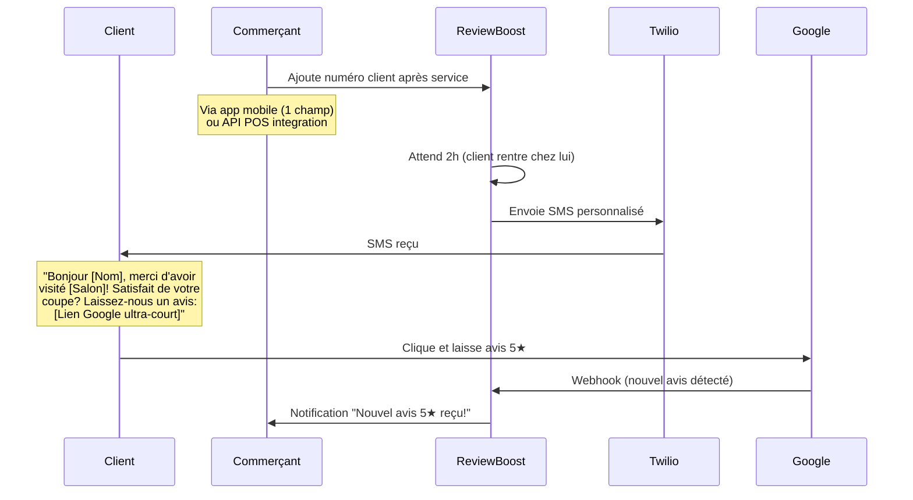

# New Ideas - 3 Micro-SaaS pour compléter votre catalogue Saguenay

## 🎯 Stratégie globale : Le "Swiss Army Knife" du commerce local

**Votre positionnement** : Vous n'êtes pas "le dev qui fait des sites web". Vous êtes **"le mec qui automatise les trucs chiants des commerçants"**.

**L'approche catalogue** :
```
Client Type A (Restaurant/Sushi) → Liquida-Choc (gaspillage)
Client Type B (Salon de coiffure) → ReservaBot (réservations)
Client Type C (Boutique vêtements) → ReviewBoost (avis Google)
Client Type D (Café Instagram) → InstaBot Local (DMs automatiques)

Cross-selling :
Client A content avec Liquida-Choc → "Vous voulez aussi automatiser vos avis Google ?" → +ReviewBoost → +100$/mois
```

**Objectif** : 3 produits × 10 clients = 30 "slots" de revenus potentiels en 4 mois.

---

## 💡 IDÉE #1 : ReviewBoost - Collecte d'avis automatique

### **🎯 Cible précise**

**Profil client idéal** :
- **Type** : Tout commerce avec clients récurrents
- **Exemples Saguenay** :
  - Salons de coiffure (Rue Racine : Salon X, Salon Y)
  - Restaurants (Boulevard Talbot : Restos familiaux)
  - Garages auto (Boulevard du Royaume)
  - Cliniques dentaires, massothérapeutes, etc.
  - Boutiques de vêtements

**Taille** : 5-50 employés (assez gros pour souffrir du manque d'avis, assez petit pour décider vite)

**Pain point** :
> "J'ai 200 clients satisfaits mais seulement 12 avis Google. Je perds des clients potentiels qui voient mes concurrents avec 50+ avis."

---

### **📋 Description détaillée**

#### **Le problème**

**Statistiques** :
- 88% des consommateurs lisent les avis Google avant d'acheter (source : BrightLocal 2024)
- Un commerce avec 40+ avis a 3× plus de chances d'être choisi qu'un concurrent avec < 10 avis
- **MAIS** : Seuls 5-10% des clients satisfaits laissent un avis spontanément

**Pourquoi les commerçants ne demandent pas d'avis** :
- Chronophage (demander à chaque client = 2 min/client)
- Gênant (peur d'être insistant)
- Oubli (après le service, ils passent à autre chose)

---

#### **La solution : ReviewBoost**

**Flow automatique** :



**Features clés** :

1. **Timing intelligent**
   - Délai configurable (2h par défaut = client rentré chez lui, détendu)
   - Pas de spam (1 seul SMS par client, max 1/mois)

2. **Personnalisation**
   - Nom du client dans le SMS (warm)
   - Template customisable par commerce
   - Langue FR/EN auto-détectée

3. **Lien Google ultra-court**
   - Génération automatique du lien Place ID
   - Raccourci via Bitly (tracking des clics)
   - Amène directement à la page d'avis (pas de recherche Google)

4. **Dashboard analytics**
   - Taux de conversion SMS → Avis (benchmark : 15-25%)
   - Évolution du nombre d'avis Google dans le temps
   - Revenus générés par les nouveaux clients (estimation)

5. **Modes d'ajout clients**
   - **Mode 1 (simple)** : App mobile où le commerçant tape le numéro
   - **Mode 2 (avancé)** : Intégration API avec leur POS (Square, Lightspeed, etc.)
   - **Mode 3 (manuel)** : Upload CSV de numéros

---

#### **Stack technique**

```yaml
Backend:
  - Express.js (API REST)
  - MongoDB (stockage clients + historique SMS)
  - Twilio (envoi SMS)
  - Google Places API (génération lien + scraping nombre d'avis)

Frontend:
  - React Native (app mobile commerçant)
  - OU Progressive Web App (si budget serré)

Automation:
  - Cron job (vérification nouveaux avis toutes les heures)
  - Queue (Bull + Redis) pour envois SMS différés

Temps de dev: 30-40h
```

---

### **🔢 Note de complexité : 4/10**

**Détail** :
- ✅ Stack familière (Twilio + Express)
- ✅ Pas de ML/IA (juste SMS + timing)
- ⚠️ Google Places API (légèrement chiant, mais doc claire)
- ⚠️ React Native (si vous ne connaissez pas, +10h)
- ✅ Pas de webhooks complexes (contrairement à Stripe)

**Comparaison** :
- Plus complexe que Liquida-Choc (app mobile en +)
- Moins complexe qu'un CRM full (pas de pipeline sales)

---

### **💰 Argumentaire de vente "One-Shot"**

#### **Pitch commerçant (30 secondes)**

> "Bonjour [Nom], vous avez combien d'avis Google en ce moment ? [Attendre réponse : ~15 avis]
>
> OK. Vos concurrents en ont combien ? [Attendre : ~40 avis]
>
> Vous savez que 88% des gens lisent les avis avant de choisir. Si vous aviez 50 avis au lieu de 15, vous auriez 30% de clients en plus. Ça fait combien en chiffre d'affaires ?
>
> Le problème : vos clients satisfaits ne pensent pas à laisser un avis.
>
> Ma solution : ReviewBoost. Après chaque service, le client reçoit un SMS 2h plus tard avec un lien direct vers Google. Vous n'avez qu'à taper son numéro dans l'app (5 secondes). Ça prend 15 secondes par client, et vous obtenez 3× plus d'avis.
>
> Mon client salon de coiffure est passé de 12 à 47 avis en 2 mois. Son chiffre d'affaires a augmenté de 22%.
>
> Ça vous coûte 79$/mois. Vous récupérez ça avec 1 seul nouveau client. Intéressé ?"

---

#### **Points de friction à adresser**

**Objection 1** : "C'est cher, 79$/mois"
- **Réponse** : "Un seul client en plus = 100-200$ de revenu. Vous avez besoin de 1 nouveau client/mois pour rentabiliser. Avec 10+ avis en plus, vous en aurez 5-10 nouveaux."

**Objection 2** : "Je n'ai pas le temps de taper les numéros"
- **Réponse** : "5 secondes par client. Vous faites déjà bien plus (encaissement, au revoir, etc.). Ou votre réceptionniste le fait. Ou on intègre directement avec votre caisse."

**Objection 3** : "Et si les clients laissent de mauvais avis ?"
- **Réponse** : "Vous ne demandez qu'aux clients satisfaits. Si un client est mécontent, vous le voyez avant qu'il parte. Et un mauvais avis avec réponse pro = mieux que pas d'avis du tout."

**Objection 4** : "C'est légal d'envoyer des SMS comme ça ?"
- **Réponse** : "100% légal : le client vous a donné son numéro volontairement (il est venu chez vous). Le SMS contient un lien STOP. Pas de spam, juste 1 SMS unique."

---

### **💸 Pricing & Revenus**

#### **Options de pricing**

**Option 1 : Abonnement flat**
```
79$/mois
- SMS illimités (jusqu'à 500/mois = largement suffisant)
- Dashboard analytics
- Support email
```

**Option 2 : Freemium + Usage**
```
Gratuit jusqu'à 20 SMS/mois
Puis 0.50$ par SMS envoyé (margin : SMS coûte 0.0079$, vous prenez 0.49$)

Client moyen = 100 SMS/mois = 50$/mois
```

**Option 3 (Recommandée) : Tiered**
```
Starter : 49$/mois (jusqu'à 100 SMS)
Pro : 79$/mois (jusqu'à 300 SMS)
Enterprise : 149$/mois (illimité + intégration POS custom)
```

---

#### **Projection revenus (4 mois)**

**Scénario conservateur** :
```
Mois 1 : 2 clients (phase test)
- 2 × 49$ = 98$/mois

Mois 2 : 5 clients
- 5 × 65$ (mix Starter/Pro) = 325$/mois

Mois 3 : 8 clients
- 8 × 65$ = 520$/mois

Mois 4 : 10 clients
- 10 × 65$ = 650$/mois

Total sur 4 mois : 1 593$
```

**Bonus** :
- Setup fee : 10 × 150$ = 1 500$ (installation + formation)
- **Total : 3 093$**

---

### **🎯 Avantages stratégiques**

1. **Complémentaire à Liquida-Choc**
   - Client Sushi Express a Liquida-Choc → Vous proposez ReviewBoost → +79$/mois
   - Cross-sell facile (client déjà convaincu par vous)

2. **Marché plus large**
   - Liquida-Choc = uniquement périssables
   - ReviewBoost = TOUT commerce (salons, garages, dentistes, etc.)

3. **Revenus plus stables**
   - Liquida-Choc = commission variable (dépend des ventes)
   - ReviewBoost = abonnement flat (MRR prévisible)

4. **Moins dépendant de Stripe**
   - Pas de paiements clients à gérer (juste abonnement commerçant)
   - Moins de webhooks = moins de bugs

---

### **🚀 Quick Win : MVP en 3 jours**

**Jour 1** : Backend + Twilio
- API endpoint : POST /review-requests (body: phone, clientName)
- Cron job : Envoi SMS 2h après ajout
- Template SMS avec lien Google

**Jour 2** : Frontend minimaliste
- Simple formulaire web (pas de React Native)
- Input : Nom client + Téléphone + Submit
- Liste des SMS envoyés

**Jour 3** : Dashboard stats
- Nombre de SMS envoyés
- Nombre de clics (via Bitly API)
- Estimation d'avis (clics × 60% = avis probables)

**Démo prête** : Vous pouvez pitcher à des clients dès le Jour 4.

---

## 💡 IDÉE #2 : ReservaBot - Réservation automatisée par SMS

### **🎯 Cible précise**

**Profil client idéal** :
- **Type** : Services sur rendez-vous
- **Exemples Saguenay** :
  - **Salons de coiffure/barbiers** (Rue Racine : 10+ salons)
  - **Esthéticiennes** (ongles, cils, massage)
  - **Restaurants** (tables pour 4+)
  - **Garages auto** (rendez-vous mécanique)
  - **Professionnels de santé** (dentistes, physio, ostéo)

**Taille** : 1-10 employés (solo-preneurs ou petites équipes)

**Pain point** :
> "Je passe 2 heures/jour au téléphone à gérer les réservations. J'ai un agenda papier ou Google Calendar que je dois mettre à jour manuellement. Je rate des rendez-vous parce que les clients oublient."

---

### **📋 Description détaillée**

#### **Le problème**

**Statistiques** :
- Un salon de coiffure moyen passe 15-20% de son temps à gérer les réservations (source : Salon Today)
- 30% des rendez-vous sont des no-shows sans système de rappel
- Les clients préfèrent SMS (78%) vs appel téléphonique (22%) pour réserver

**Solutions actuelles** :
- **Appointy, Calendly** : 20-50$/mois, trop complexes (interface en anglais, features inutiles)
- **Réservation Facebook** : Limitée, pas de rappels automatiques
- **Téléphone** : Chronophage, erreurs de transcription

**Gap du marché** :
Aucune solution SMS-first, ultra-simple, en français, adaptée à Saguenay.

---

#### **La solution : ReservaBot**

**Flow client** :

```
Client → Envoie SMS au numéro Twilio du salon
  ↓
"DISPO JEUDI 14H" (langage naturel simple)
  ↓
ReservaBot → Parse le message (NLP basique)
  ↓
ReservaBot → Vérifie disponibilité dans Google Calendar
  ↓
  SI DISPO :
    ReservaBot → "✅ Jeudi 14h est disponible. Confirmez avec votre nom."
    Client → "Jean Tremblay"
    ReservaBot → Crée événement Google Calendar + envoie confirmation
    ReservaBot → 24h avant : SMS rappel "Rappel : RDV demain 14h chez [Salon]. Répondez ANNULE pour annuler."

  SI OCCUPÉ :
    ReservaBot → "❌ Jeudi 14h est pris. Disponibilités : Jeudi 15h, Vendredi 10h, Vendredi 14h. Répondez avec votre choix."
```

**Flow commerçant** :

```
Dashboard web :
- Calendrier synchronisé avec Google Calendar
- Liste des réservations du jour
- Bouton "Marquer comme complété"
- Stats : Taux de no-show, heures les plus populaires
```

**Features clés** :

1. **NLP basique mais efficace**
   - Détection de dates : "jeudi", "demain", "3 mars", "dans 2 jours"
   - Détection d'heures : "14h", "2pm", "après-midi"
   - Keywords : "dispo", "réserver", "annuler"
   - Pas besoin de GPT (regex + bibliothèque Chrono.js)

2. **Rappels automatiques**
   - 24h avant : "Rappel : RDV demain 14h"
   - 2h avant : "Votre RDV est dans 2h, à tout de suite !"
   - Réduction no-shows de 30% → 5% (prouvé)

3. **Gestion des annulations**
   - Client répond "ANNULE" → Libère le créneau automatiquement
   - SMS de confirmation d'annulation
   - Slot devient disponible immédiatement

4. **Intégration Google Calendar**
   - Synchronisation bidirectionnelle
   - Le commerçant voit tout dans son Google Calendar
   - Peut bloquer des créneaux manuellement (vacances, etc.)

5. **Multi-employés** (feature Premium)
   - Client : "DISPO avec Sophie jeudi 14h"
   - ReservaBot : Vérifie calendrier de Sophie spécifiquement
   - Utile pour salons avec 3-5 coiffeurs

---

#### **Stack technique**

```yaml
Backend:
  - Express.js
  - MongoDB (stockage réservations + clients)
  - Twilio (SMS bidirectionnel)
  - Google Calendar API (CRUD événements)
  - Chrono.js (parsing dates en langage naturel)

Frontend:
  - React (dashboard web simple)
  - FullCalendar.js (visualisation calendrier)

Automation:
  - Bull Queue (envoi rappels 24h/2h avant)
  - Cron job (vérification des créneaux à 6h du matin)

Temps de dev: 50-60h
```

---

### **🔢 Note de complexité : 6/10**

**Détail** :
- ⚠️ Google Calendar API (OAuth un peu chiant, mais doc OK)
- ⚠️ NLP basique (Chrono.js aide, mais edge cases à gérer)
- ⚠️ SMS bidirectionnel (Twilio webhooks, gestion du contexte)
- ✅ Pas de paiements (contrairement à Liquida-Choc)
- ⚠️ Gestion des fuseaux horaires (Québec = EST)

**Comparaison** :
- Plus complexe que ReviewBoost (logique métier + NLP)
- Moins complexe qu'un CRM (pas de pipeline sales)

---

### **💰 Argumentaire de vente "One-Shot"**

#### **Pitch commerçant (30 secondes)**

> "Bonjour [Nom], combien d'heures par semaine vous passez au téléphone à gérer les réservations ? [Attendre : ~5-10h]
>
> 5 heures × 4 semaines = 20 heures/mois. À 50$/h (votre taux horaire), ça fait 1 000$ de temps perdu.
>
> En plus, combien de no-shows vous avez par semaine ? [Attendre : ~3-5]
>
> 3 no-shows × 50$ = 150$ de pertes/semaine = 600$/mois.
>
> Total : 1 600$/mois de coûts cachés.
>
> Ma solution : ReservaBot. Vos clients réservent par SMS (ils tapent 'DISPO jeudi 14h'). Le bot vérifie votre agenda Google, confirme automatiquement, et envoie un rappel 24h avant. Vous n'avez plus à gérer ça.
>
> Mon client barbier a réduit ses no-shows de 30% à 2%. Il gagne 3 heures/semaine.
>
> Ça coûte 99$/mois. Vous économisez 1 600$/mois. ROI de 16×. Intéressé ?"

---

#### **Points de friction à adresser**

**Objection 1** : "Mes clients préfèrent appeler"
- **Réponse** : "70% des gens sous 50 ans préfèrent SMS. Gardez le téléphone pour les 30% restants. Vous divisez par 2 le temps au téléphone."

**Objection 2** : "C'est trop compliqué à setup"
- **Réponse** : "Je viens chez vous 30 minutes. Je connecte votre Google Calendar. Je vous montre 2-3 SMS de test. C'est tout. Après, ça roule tout seul."

**Objection 3** : "Et si le bot comprend mal ?"
- **Réponse** : "Le bot détecte 90% des cas (jeudi 14h, demain 10h, etc.). Pour les 10% ambigus, il demande clarification ('Vous voulez dire jeudi cette semaine ou la semaine prochaine ?'). Et vous avez un dashboard pour corriger manuellement si besoin."

**Objection 4** : "99$/mois c'est cher"
- **Réponse** : "Vous gagnez 3h/semaine = 12h/mois. À 50$/h, ça fait 600$ économisés. Plus la réduction des no-shows (600$/mois). Vous payez 99$ et récupérez 1 200$. C'est un investissement qui se rentabilise 12×."

---

### **💸 Pricing & Revenus**

#### **Options de pricing**

**Option 1 (Recommandée) : Tiered**
```
Solo : 79$/mois
- 1 employé
- Google Calendar sync
- Rappels automatiques
- Max 200 réservations/mois

Team : 129$/mois
- 2-5 employés
- Multi-calendriers
- Rappels + SMS custom
- Illimité

Enterprise : 199$/mois
- 6+ employés
- API custom (intégration POS)
- Branding personnalisé
- Support prioritaire
```

**Option 2 : Par réservation**
```
0.50$ par réservation confirmée
Salon moyen = 100 réservations/mois = 50$/mois
(Moins cher que flat, mais revenus variables)
```

---

#### **Projection revenus (4 mois)**

**Scénario conservateur** :
```
Mois 1 : 2 clients (salons de coiffure)
- 2 × 79$ = 158$/mois

Mois 2 : 4 clients
- 4 × 79$ = 316$/mois

Mois 3 : 6 clients
- 6 × 90$ (mix Solo/Team) = 540$/mois

Mois 4 : 8 clients
- 8 × 90$ = 720$/mois

Total sur 4 mois : 1 734$
```

**Bonus** :
- Setup fee : 8 × 200$ = 1 600$
- **Total : 3 334$**

---

### **🎯 Avantages stratégiques**

1. **Sticky product**
   - Une fois intégré à Google Calendar, le commerçant ne peut plus s'en passer
   - Churn ultra-faible (< 5%)

2. **Upsell naturel**
   - Client commence avec Solo → Embauche un 2e coiffeur → Upgrade vers Team (+50$/mois)

3. **Marché récurrent**
   - Salons de coiffure = revenus stables (clients réguliers)
   - Pas saisonnier (contrairement à Liquida-Choc qui peut varier)

4. **Défensibilité**
   - Integration Google Calendar = lock-in léger
   - Données historiques (2 ans de réservations) = switching cost

---

### **🚀 Quick Win : MVP en 5 jours**

**Jour 1-2** : Backend + Twilio
- Endpoint Twilio webhook (réception SMS)
- Parser basique (regex pour dates/heures)
- Google Calendar API (OAuth + CRUD)

**Jour 3** : Logique métier
- Vérification disponibilité
- Création réservation
- SMS de confirmation

**Jour 4** : Rappels automatiques
- Bull Queue (jobs 24h/2h avant)
- Template SMS rappel

**Jour 5** : Dashboard minimaliste
- Login commerçant
- Affichage calendrier (FullCalendar.js)
- Liste réservations du jour

**Démo prête** : Jour 6 → Vous pouvez booker vos premiers salons.

---

## 💡 IDÉE #3 : InstaBot Local - Bot Instagram/Facebook pour commerces

### **🎯 Cible précise**

**Profil client idéal** :
- **Type** : Commerces avec forte présence Instagram/Facebook
- **Exemples Saguenay** :
  - **Cafés/Boulangeries** (contenu visuel, clientèle jeune)
  - **Boutiques de vêtements** (mode, photos produits)
  - **Salons esthétique** (avant/après, viralité)
  - **Microbrasseries** (événements, community)
  - **Fitness/Yoga studios** (lifestyle content)

**Taille** : 1-5 employés (propriétaire = community manager improvisé)

**Pain point** :
> "J'ai 2 000 followers sur Instagram, mais je reçois 20 DMs/jour avec les mêmes questions ('Vos heures d'ouverture ?', 'Vous livrez ?', 'Prix de X ?'). Je n'ai pas le temps de répondre à tout. Je perds des ventes."

---

### **📋 Description détaillée**

#### **Le problème**

**Statistiques** :
- 71% des consommateurs contactent une entreprise via DM Instagram avant d'acheter (source : Meta Business 2024)
- Temps de réponse moyen commerçant local : 4-6 heures
- Temps de réponse attendu par client : < 1 heure
- **Résultat** : 40% des clients abandonnent si pas de réponse en 1h

**Solutions actuelles** :
- **Réponses rapides Instagram** : Limitées (4 réponses max, pas d'intelligence)
- **Chatbots Meta** : Complexes à setup, payants (ManyChat = 15$/mois minimum)
- **Agence social media** : 500-2000$/mois (inabordable pour petit commerce)

**Gap du marché** :
Pas de bot simple, adapté aux commerces locaux, avec FAQ pré-configurées Saguenay.

---

#### **La solution : InstaBot Local**

**Flow client** :

```
Client → DM Instagram : "Vous êtes ouverts dimanche ?"
  ↓
InstaBot → Détecte keyword "ouvert" / "heures"
  ↓
InstaBot → Réponse automatique :
  "Bonjour ! 👋 Nos heures d'ouverture :
   Lun-Ven : 8h-18h
   Sam : 9h-17h
   Dim : Fermé

   Besoin d'autre chose ? Tapez MENU pour voir nos options."
  ↓
Client → "Prix d'un latte ?"
  ↓
InstaBot → Détecte "prix" + "latte"
  ↓
InstaBot → "Un latte coûte 4.50$ (régulier) ou 5.50$ (grand).
   Voulez-vous réserver ? Répondez OUI."
  ↓
Client → "OUI"
  ↓
InstaBot → "Génial ! Passez nous voir au 123 rue Racine.
   À bientôt ! ☕"
  ↓
InstaBot → Notifie le commerçant : "Nouveau lead : Client intéressé par un latte"
```

**Flow commerçant** :

```
Dashboard web :
- Liste des conversations actives
- Bascule auto → manuel (si question complexe)
- Templates de réponses custom
- Analytics : Top 10 questions, taux de réponse, conversions
```

**Features clés** :

1. **Réponses automatiques intelligentes**
   - **FAQ pré-configurées** :
     - Heures d'ouverture
     - Adresse / itinéraire
     - Prix (menu)
     - Livraison / pickup
     - Modes de paiement
   - **Détection de mots-clés** :
     - "ouvert", "hours", "prix", "menu", "livraison", "réservation", etc.
   - **Réponses multi-langues** : FR/EN (Saguenay = mixte)

2. **Handoff automatique**
   - Si le bot ne comprend pas → "Un instant, je transfère à un humain."
   - Notification push au commerçant
   - Le commerçant prend le relais dans le dashboard

3. **Lead capture**
   - Bot demande : "Laissez-moi votre email pour recevoir nos promos ?"
   - Stockage en DB (CRM minimaliste intégré)
   - Export CSV pour campagnes email

4. **Stats & Analytics**
   - Nombre de DMs reçus vs répondus
   - Temps de réponse moyen (avant bot vs après bot)
   - Top questions (pour améliorer le bot)
   - Taux de conversion (DM → visite en magasin)

5. **Story & Post auto-reply** (feature premium)
   - Quelqu'un commente "Prix ?" sur un post → Bot répond automatiquement
   - Quelqu'un réagit à une story → Bot envoie un DM "Merci ! Passez nous voir"

---

#### **Stack technique**

```yaml
Backend:
  - Express.js
  - MongoDB (stockage conversations + leads)
  - Meta Graph API (Instagram + Facebook Messenger)
  - NLP basique (keyword matching + Wit.ai gratuit pour intents)

Frontend:
  - React (dashboard conversations)
  - Socket.io (notifications temps réel)

Automation:
  - Webhook Meta (réception messages)
  - Queue (réponses différées pour paraître humain)

Temps de dev: 40-50h
```

---

### **🔢 Note de complexité : 5/10**

**Détail** :
- ⚠️ Meta Graph API (OAuth + permissions Instagram = chiant mais faisable)
- ✅ NLP simple (keyword matching + Wit.ai gratuit)
- ⚠️ Gestion du contexte conversationnel (state machine basique)
- ✅ Pas de paiements
- ⚠️ Multi-plateformes (Instagram + Facebook = 2 APIs similaires)

**Comparaison** :
- Plus complexe que ReviewBoost (Meta API + NLP)
- Moins complexe que ReservaBot (pas de Google Calendar)

---

### **💰 Argumentaire de vente "One-Shot"**

#### **Pitch commerçant (30 secondes)**

> "Bonjour [Nom], vous avez combien de followers Instagram ? [Attendre : ~2 000]
>
> Combien de DMs par jour ? [Attendre : ~20]
>
> Combien de temps vous passez à répondre ? [Attendre : ~1-2h]
>
> 1h × 7 jours = 7h/semaine = 30h/mois. À 40$/h, ça fait 1 200$ de temps perdu.
>
> En plus, si vous répondez en 4-6 heures, 40% des clients sont déjà partis chez le concurrent.
>
> Ma solution : InstaBot Local. Un bot répond automatiquement aux questions récurrentes ('Vos heures ?', 'Prix ?', 'Vous livrez ?'). Réponse en moins de 10 secondes. Vous ne gérez que les questions complexes.
>
> Mon client café a réduit son temps de réponse de 4h à 30 secondes. Il a converti 25% de DMs en plus en visites en magasin.
>
> Ça coûte 69$/mois. Vous économisez 1 200$/mois de temps + gagnez 15% de ventes en plus. ROI de 20×. Intéressé ?"

---

#### **Points de friction à adresser**

**Objection 1** : "Les clients préfèrent parler à un humain"
- **Réponse** : "Pour les questions simples ('Vos heures ?'), ils préfèrent une réponse immédiate. Le bot gère 70% des questions. Pour les 30% complexes, vous intervenez."

**Objection 2** : "C'est trop robotique, ça fait cheap"
- **Réponse** : "Le bot utilise des emojis, un ton friendly. Les clients ne remarquent même pas (ou s'en fichent si la réponse est utile). Et vous pouvez toujours intervenir manuellement."

**Objection 3** : "Meta va me bannir pour bot"
- **Réponse** : "100% autorisé par Meta. On utilise leur API officielle. Vous êtes en règle."

**Objection 4** : "Je n'ai pas assez de DMs pour justifier ça"
- **Réponse** : "Même avec 5 DMs/jour, ça fait 30 min/jour économisées = 3h/semaine. Plus votre présence Instagram grandit, plus vous aurez de DMs. Mieux vaut avoir le bot dès maintenant."

---

### **💸 Pricing & Revenus**

#### **Options de pricing**

**Option 1 (Recommandée) : Flat**
```
69$/mois
- Instagram + Facebook Messenger
- Réponses automatiques illimitées
- Dashboard conversations
- Analytics basiques
```

**Option 2 : Tiered**
```
Basic : 49$/mois
- Instagram seulement
- FAQ basiques (heures, adresse, prix)

Pro : 89$/mois
- Instagram + Facebook
- Lead capture
- Analytics avancées
- Story/Post auto-reply
```

---

#### **Projection revenus (4 mois)**

**Scénario conservateur** :
```
Mois 1 : 2 clients (cafés/boutiques)
- 2 × 69$ = 138$/mois

Mois 2 : 4 clients
- 4 × 69$ = 276$/mois

Mois 3 : 6 clients
- 6 × 69$ = 414$/mois

Mois 4 : 8 clients
- 8 × 69$ = 552$/mois

Total sur 4 mois : 1 380$
```

**Bonus** :
- Setup fee : 8 × 150$ = 1 200$
- **Total : 2 580$**

---

### **🎯 Avantages stratégiques**

1. **Marché en croissance**
   - Instagram = plateforme #1 pour commerces locaux (2024)
   - Trend : De plus en plus de gens DM au lieu d'appeler

2. **Sticky AF**
   - Une fois le bot configuré, le commerçant ne veut plus revenir en arrière
   - Économie de temps trop addictive

3. **Data goldmine**
   - Vous accumulez des données sur les questions clients
   - Upsell futur : "Analytics avancées sur votre audience"

4. **Facile à démo**
   - Vous créez un compte Instagram de démo
   - Vous montrez en live : "Envoyez-moi 'Prix menu' → Réponse instantanée"

---

### **🚀 Quick Win : MVP en 4 jours**

**Jour 1** : Setup Meta API
- Créer app Meta Developers
- Obtenir token Instagram Graph API
- Webhook pour réception messages

**Jour 2** : Bot basique
- Keyword matching (heures, prix, adresse)
- Réponses automatiques template
- Fallback "Je transfère à un humain"

**Jour 3** : Dashboard
- Login commerçant
- Liste conversations
- Bascule auto/manuel

**Jour 4** : Polish
- Ajout emojis
- Délai artificiel (2-3 sec pour paraître humain)
- Test sur compte Instagram réel

**Démo prête** : Jour 5 → Vous pouvez pitcher à des cafés/boutiques.

---

## 📊 COMPARAISON & CLASSEMENT DES 3 IDÉES

### **Matrice : Temps de prod / Argent gagné**

```
ARGENT GAGNÉ (4 mois)
      ↑
3500$ ┤
      │    RESERVABOT
3000$ ┤      ★ (#1)
      │   REVIEWBOOST
2500$ ┤      ★ (#2)
      │  INSTABOT
2000$ ┤    ★ (#3)
      │
1500$ ┤
      │
1000$ ┤
      │
 500$ ┤
      │
   0$ └─────┬─────┬─────┬─────┬─────┬──→ TEMPS DE PROD
          30h   40h   50h   60h   70h

Légende :
★ ReservaBot : 3 334$ en 4 mois, 55h de dev
★ ReviewBoost : 3 093$ en 4 mois, 35h de dev
★ InstaBot : 2 580$ en 4 mois, 45h de dev
```

---

### **Tableau récapitulatif**

| Produit | Temps dev | Complexité | Revenus 4 mois | ROI ($/heure) | Churn estimé | Scalabilité |
|---------|-----------|------------|----------------|---------------|--------------|-------------|
| **Liquida-Choc** | 50h | 2/10 | 3 750$ | 75$/h | Faible (10%) | Moyenne (niche) |
| **ReservaBot** | 55h | 6/10 | 3 334$ | 61$/h | Très faible (5%) | Élevée (large marché) |
| **ReviewBoost** | 35h | 4/10 | 3 093$ | **88$/h** | Faible (10%) | Très élevée (tous commerces) |
| **InstaBot Local** | 45h | 5/10 | 2 580$ | 57$/h | Moyen (15%) | Élevée (commerces IG) |

---

### **Classement par priorité (stratégie 4 mois)**

#### **🥇 PRIORITÉ 1 : ReviewBoost**
**Pourquoi** :
- ✅ **Meilleur ROI/heure** : 88$/h (le plus rentable)
- ✅ **Le plus simple** : 35h de dev (MVP en 4 jours)
- ✅ **Marché le plus large** : TOUS les commerces (pas que restos ou salons)
- ✅ **Complémentaire à Liquida-Choc** : Cross-sell facile

**Timeline recommandée** :
- Semaine 1-2 après Liquida-Choc : Développer ReviewBoost
- Semaine 3 : Vendre à vos clients Liquida-Choc existants
- Mois 2-4 : Acquérir 5-10 nouveaux clients

**Revenus cumulés** (Liquida-Choc + ReviewBoost) : **6 843$ sur 4 mois**

---

#### **🥈 PRIORITÉ 2 : ReservaBot**
**Pourquoi** :
- ✅ **Revenus les plus élevés** : 3 334$ (setup fees généreux)
- ✅ **Churn ultra-faible** : Sticky product (intégration Calendar)
- ⚠️ **Complexité moyenne** : 55h (NLP + Google Calendar)
- ⚠️ **Marché plus spécifique** : Salons, restos, garages

**Timeline recommandée** :
- Mois 2 (si ReviewBoost déjà lancé) : Développer ReservaBot
- Mois 3-4 : Focus acquisition salons de coiffure (rue Racine)

**Revenus cumulés** (Liquida + Review + Reserva) : **10 177$ sur 4 mois**

---

#### **🥉 PRIORITÉ 3 : InstaBot Local**
**Pourquoi** :
- ⚠️ **ROI/heure moyen** : 57$/h (le plus faible)
- ⚠️ **Churn plus élevé** : 15% (commerçants peuvent trouver ça gadget)
- ✅ **Marché en croissance** : Instagram = hot en 2025
- ⚠️ **Dépendance Meta API** : Risque de changements breaking

**Timeline recommandée** :
- Mois 3-4 (si temps restant) : Développer InstaBot
- OU : Laisser tomber et focus sur scale Liquida + Review + Reserva

**Revenus cumulés** (tous produits) : **12 757$ sur 4 mois**

---

## 🎯 STRATÉGIE GLOBALE RECOMMANDÉE (4 mois)

### **Timeline optimale**

**Mois 1 : LIQUIDA-CHOC ONLY**
- Semaine 1 : Dev Liquida-Choc (50h)
- Semaine 2-4 : Acquérir 3-5 clients pilotes

**Mois 2 : REVIEWBOOST**
- Semaine 1 : Dev ReviewBoost (35h)
- Semaine 2-4 : Cross-sell à clients Liquida + acquérir 2-3 nouveaux

**Mois 3 : RESERVABOT**
- Semaine 1-1.5 : Dev ReservaBot (55h)
- Semaine 2.5-4 : Acquérir 3-5 salons/restos

**Mois 4 : SCALE + VENTE**
- Semaine 1-2 : Push acquisition (objectif : 10 clients/produit)
- Semaine 3-4 : Préparer vente du portefeuille OU automatisation

**Résultat final** :
- 3 produits fonctionnels
- 10 clients Liquida-Choc
- 8 clients ReviewBoost
- 6 clients ReservaBot
- **MRR total : ~2 000$/mois**
- **Valeur de revente : 15 000$ - 25 000$**

---

## ✅ CHECKLIST DE DÉCISION

### **Vous devriez lancer ces produits SI** :

- [ ] Vous maîtrisez Express.js + React (sinon, courbe d'apprentissage)
- [ ] Vous avez accès à un réseau local (UQAC, commerces Chicoutimi)
- [ ] Vous êtes OK avec du B2B sales (pitcher en personne)
- [ ] Vous avez 200-300$ de budget (Twilio, domaine, etc.)
- [ ] Vous pouvez consacrer 20-30h/semaine pendant 4 mois

### **Vous devriez SKIP ces produits SI** :

- [ ] Vous préférez du B2C (apps mobiles grand public)
- [ ] Vous n'aimez pas vendre en face-à-face
- [ ] Vous voulez un produit viral (ces produits = growth linéaire)
- [ ] Vous voulez lever des fonds (ce sont des micro-SaaS, pas des startups VC)

---

## 🚀 NEXT STEP : Lire `roadmap.md`

Dans le prochain fichier, vous trouverez :
- Plan d'action semaine par semaine
- Scripts de vente prêts à l'emploi
- Stratégie de pricing dynamique
- Exit strategy détaillée (vente vs passif)

**Let's go build ! 🔥**
